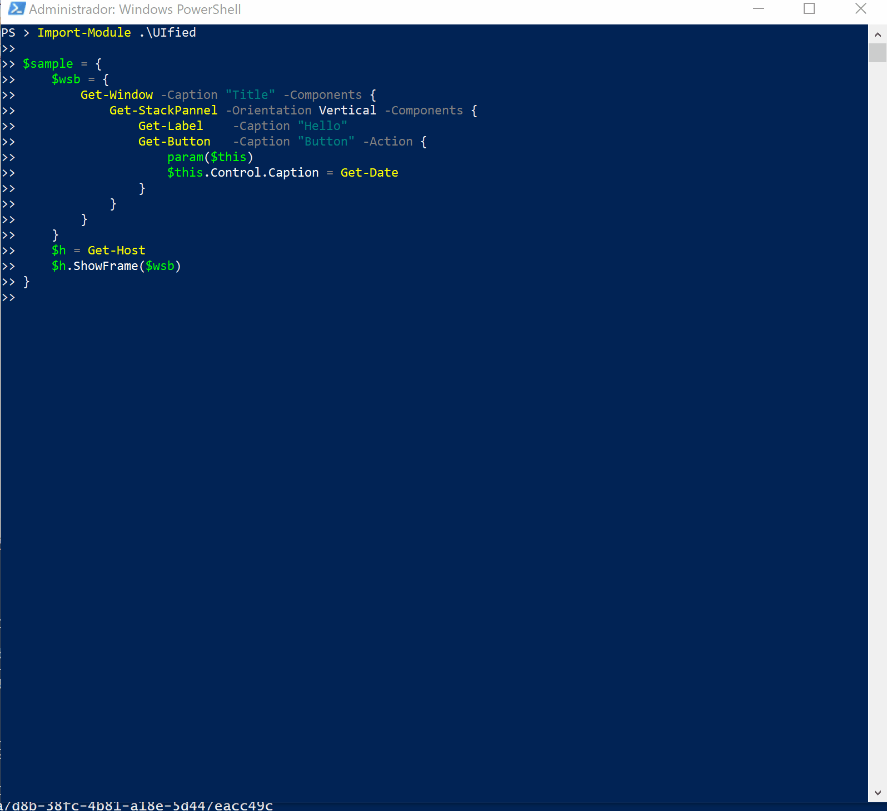

# UIfied

A unified PowerShell DSL for multiple UIs.

## Simple DSL

Write complex UIs the easy way with the UIfied DSL

    $wsb = {
        Get-Window -Caption "Title" -Components {
            Get-StackPannel -Orientation Vertical -Components {
                Get-Label    -Caption "Hello"
                Get-Button   -Caption "Button" -Action {
                    param($this)
                    $this.Control.Caption = Get-Date
                }
            }
        }
    }
    $h = Get-Host
    $h.ShowFrame($wsb)

## Three UI types supported

UIFied supports tree UI types

- Windows: UIfied creates WPF UIs.
- Console: UIfied uses [ConsoleFramework](https://github.com/elw00d/consoleframework) for console UIs.
- Web: UIfied web support is based on [Ooui](https://github.com/praeclarum/Ooui).

Write once and use it accross differents UIs. You can switch the target UI framework by simply using a command.

    Set-UICF     # Switch to console UI
    Set-UIWPF    # Switch to Windows Presentation Foundation UI
    Set-UIOoui   # Switch to Web UI

## Controls

We have implemented these controls:

- Button
- CheckBox
- Label
- List
- ListColumn
- ListItem
- RadioButton
- RadioGroup
- StackPannel
- TabControl
- TabItem
- TextBox
- Modal
