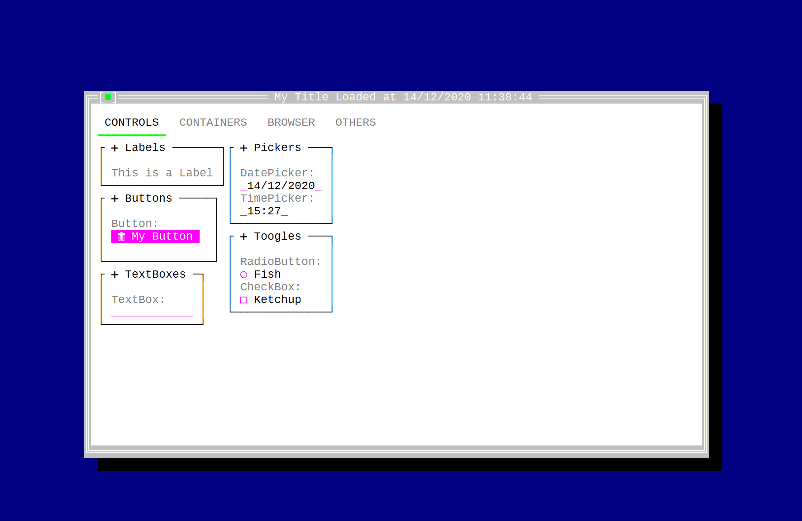
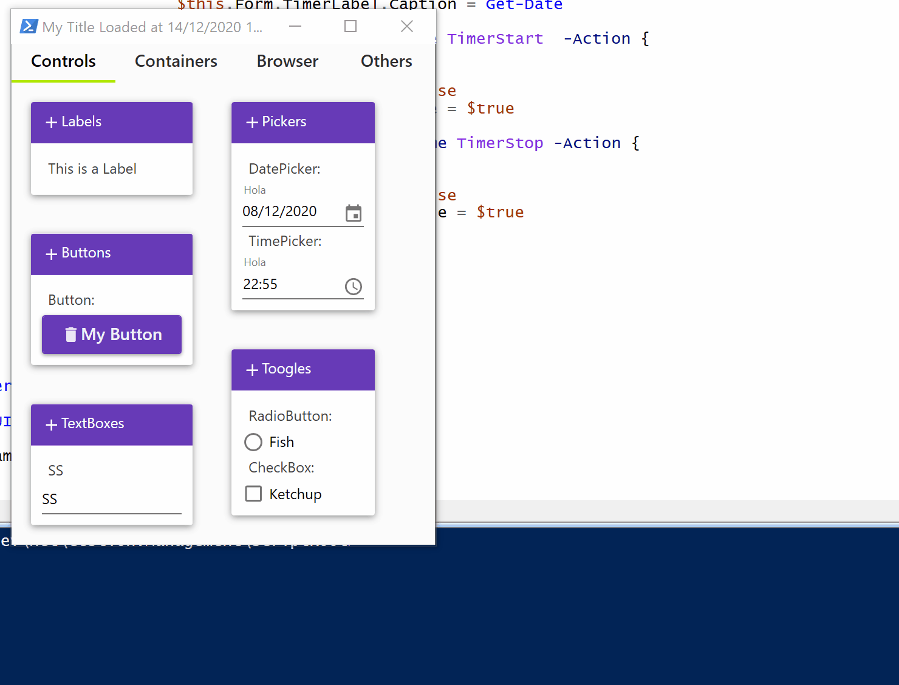
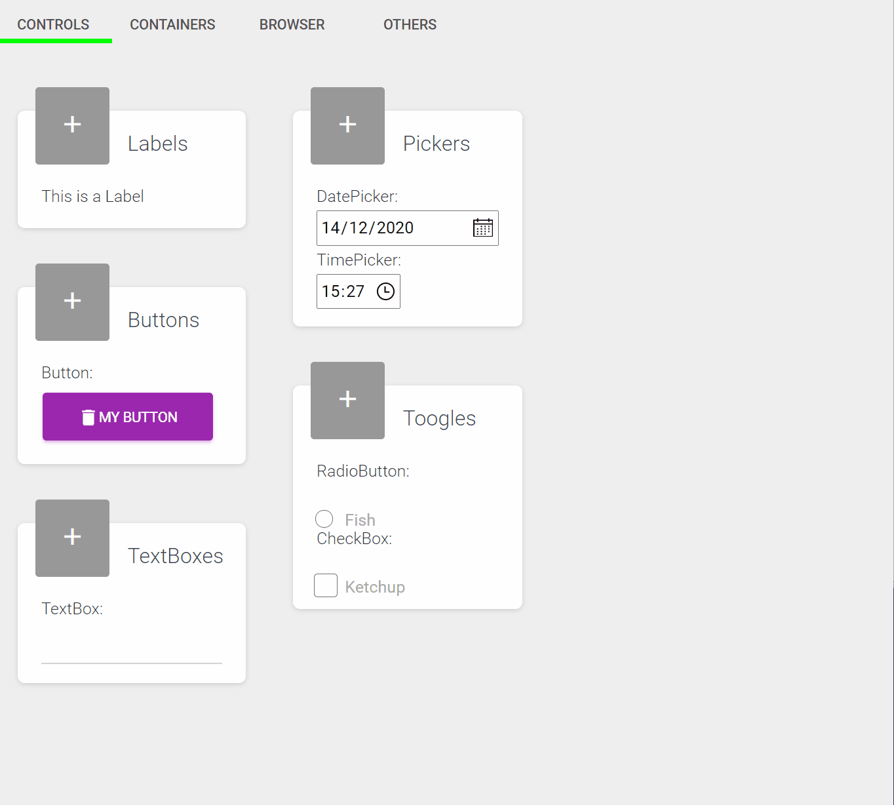

# UIfied

A unified PowerShell DSL for multiple UIs.

## Simple DSL

Write complex UIs the easy way with the UIfied DSL

    $sample = {
        $wsb = {
            UIWindow -Caption "Title" -Components {
                UIStackPanel -Orientation Vertical -Components {
                    UILabel    -Caption "Hello"
                    UIButton   -Caption "Button" -Action {
                        param($this)
                        $this.Control.Caption = Get-Date
                    }
                }
            }
        }
        $h = Get-UIHost
        $h.ShowFrame($wsb)
    }

    Set-UIWpf
    Invoke-Command -ScriptBlock $sample

## Six UI types supported

UIFied supports four UI flavors

- Windows: UIfied creates WPF UIs.
- Console: UIfied uses [ConsoleFramework](https://github.com/elw00d/consoleframework) for console UIs.
- Web: UIfied web support is based on [Ooui](https://github.com/praeclarum/Ooui).
- Material Windows: WPF with Material Design flavor based on [MaterialDesignInXamlToolkit](https://github.com/MaterialDesignInXAML/MaterialDesignInXamlToolkit).
- Material Console: Console with Material Design flavor. You must install [Literation Mono Nerd Font Complete Mono Windows Compatible.ttf](https://github.com/ryanoasis/nerd-fonts) fonts for correct icon visualization.
- Material Web: Web with Material Design flavor

Write once and use it accross differents UIs. You can switch the target UI framework by simply using a command.

    Set-UICF              # Switch to console UI
    Set-UIWPF             # Switch to Windows Presentation Foundation UI
    Set-UIOoui            # Switch to Web UI
    Set-UIMaterialCF      # Switch to Material Design console UI
    Set-UIMaterialWPF     # Switch to Material Design WPF UI
    Set-UIMaterialOoui    # Switch to Material Design Web UI

## Controls

We have implemented these controls:

- Button
- CheckBox
- Label
- List
- ListColumn
- ListItem
- RadioButton
- RadioGroup
- StackPanel
- TabControl
- TabItem
- TextBox
- Modal
- Timer
- DatePicker
- TimePicker
- Browser
- Autocomplete
- Icon
- Card
- Image
- TextEditor
- Expander

## Screenshots

Material Design console sample

Material Design windows sample

Material Design web sample

